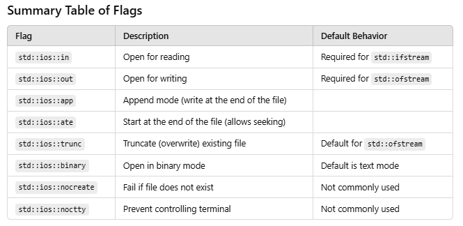
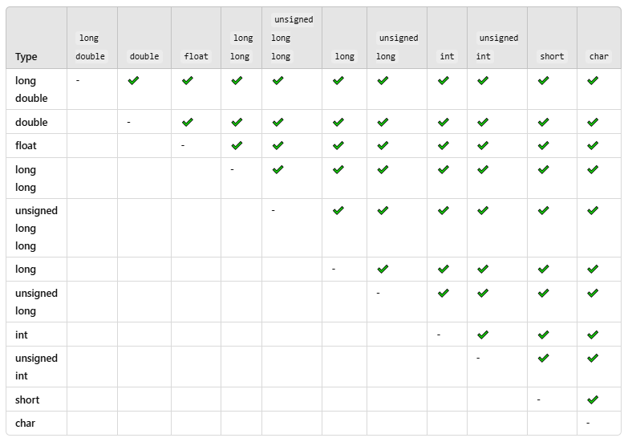
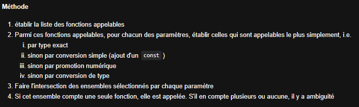

# Exercices récapitulatifs

Ce répertoire contient quelques exercices récapitulatifs. 

Les exercices qui s'y trouvent visent à avoir une longueur et 
une difficulté similaire aux exercices d'écriture de code de 
l'examen final.

### Exercices conseillés pour la préparation à l'examen
- **02 - Elements de base**
    - 03-01 - operateurs
    - 03-04 - evaluation expressions
    - 03-08 - concatenation des strings
    - 04-02 - pointeurs
    - 05-01 - Priorité des opérateurs

*Notes :*
- 03-01 : ++a → on incrémente puis on évalue (pas de copie)
              a++ → on évalue puis on incrémente (fait une copie)
- 03-04 : si un OR retourne vrai avec la 1ere condition, la 2eme n'est pas
          évaluée (sinon elle evalue les 2).
          Dans le meme sens si un AND retourne faux avec la 1ere cond,
          la 2eme n'est pas évaluée.
- 03-08 : "A" n'est pas un string std, mais c-style → on ne peut pas "A" + "BC"
          to_string(x) convertit x en string
- 04-02 : pointeur → int* ptr;
          le faire pointer vers int i = 2 → ptr = &i
          prendre la valeur → *ptr;
          addresse : &ptr, &i ect.
          ternaire : (cond1 "=/>/<" cond2 ? true : false);
          un int* ne peut pas pointer sur une cste (mais un const int* oui)
          pointeur constant sur une constante : const int* const ptr = &a;
- 05-01 : [C++ Operator Precedence](https://en.cppreference.com/w/cpp/language/operator_precedence)
          à revoir
          TLDR : grouper
          Highest Precedence
          Arithmetic Operators
          Relational Operators
          Logical Operators
          Assignment and Low Precedence

- **03 - Structures de Controle**
    - 01-03 - opérateur ternaire
    - 02-02 - while (2)
    - 02-10 - boucles imbriquees
    - 03-01 - continue et break dans boucle do ... while
    - 03-02 - continue et break une boucle et un switch

*Notes :*
- 01-03 : ternaire : (cond1 "=/>/<" cond2 ? true : false);
- 02-02 : while : while (condition) { // do this while cond == true}
- 02-10 : penser aux matrices ou double sommes
- 03-01 : continue → skip à la prochaine itération
          break → sort du loop
- 03-02 : ne pas mettre de break dans un switch → fall au cas d'après (panier percé)

- **04 - Fonctions**
    - 04-02 - minimum
    - 05-03 - que produisent ces codes

*Notes :*
- 04-02 : éviter de copier des objets lourds → on renvoye une référence et on utilise les ref
- 05-03 : pour une fonction récursive, l'appeller dans elle-même est une bonne solution.

- **05 - Flux**
    - 01-01 - ecriture dans un fichier
    - 01-02 - lecture et ajout dans un fichier

*Notes :*
- 01-01/02 : mode écriture
          std::ofstream fichier_sortie(nom_fichier, std::ios::app); (append, sans app → overwrite)
          mode lecture
          std::ifstream fichier_entree(nom_fichier);
          → vérifier que le fichier est ouvert if(!ficher_sortie) std::cerr<<"erreur ouverture";
          → fermer le fichier : fichier_sortie.close

- tous les flags :

- **06 - Types arithmétiques et conversions**
    - 02-02 - Plus petit entier non representable
    - 03-02 - Evaluation d'expressions (2)
    - 04-02 - Conversions implicites

*Notes :*
- 02-02 : numeric_limits<float>::epsilon() → plus petite valeur positive de float
            std::numeric_limits<float>::digits → nb de bits dans float
A FAIRE pour entrainement 0202
- 03-02 : on peut cast un type t.q. (double) opération → on a un double en sortie.
- 04-02 : unsigned ne peut pas représenter les nb négatifs → overflow repart à 0, mais signed → indéfini si ovf

- conversion ; certains types peuvent être promus tel que la chart ci-dessous :

Noter que le type de la colonne peut être promu quand il y a une checkmark dans la ligne.
i.e. char peut promote en tout, alors que short ne sera pas promu en char car il est +grand.

- **07 - Structure_Enum**
    - 01-03 - acces_membres
    - 02-01 - Premiere et derniere lettres

*Notes :*
- 01-03 : l'operateur . est prioritaire sur le déreferencement
            on peut faire un pointeur sur un objet
- 02-01 : std::pair<type1, type2> est une paire de 2 types quelquonques, tableau size2

REVOIR stringview

exemple struct et enum :
~~~cpp
struct Coord {
int x, y, z;
};

struct Cercle {
int   rayon;
Coord centre;
};
~~~

- **08 - Chaines de caracteres**
    - 02-01 - string constructeurs
    - 02-02 - string assign append concat
    - 02-03 - string acces et substr
    - 04-01 - string insert replace et erase
    - 04-05 - Remplacer toutes les occurrences

*Notes :*
- 02-01 : substring : string sub(string1, startIndex, length);
            un string se termine par '\0' (1 char)
- 02-02 : substring.assign(string1, startIndex, length);
          string.assign(5, 'A') → met 5 'A' dans string
          string.assign("ABCD", 2) → met "AB" dans string (2 → length)
- 02-03 : s.at(i) → throw exception quand out of bounds -> sinon comme s[i]
          string str = s.substr(startIndex, length)  → crée un substring de s
          1 argument : start
          0 arguments : copie la string
          s.size() ou s.length() donne la taille de la string s
- 04-01 : s.insert(insertionIndex, sToInsert, startS, endS)
          insère sToInsert depuis startS index à endS index; insère a la position insertionIndex.
          s.replace(pos, len, string)
          remplace depuis pos, d'une taille len, avec le string. (coupe depuis pos de len, insère le string)
          si le string est plus petit que len, le string est remis jusqu'a atteindre len minimum.
          s.erase(pos, len)
          supprime len charactères depuis pos. si 1 seul param, supprime depuis pos jusqua la fin.
  - 04-05 : s.find(string, pos) cherche string dans s a partir de pos
            s.find(string, pos, n) cherche les n premiers chars de string dans s a partir de pos
            s.find(string) retourne la pos du 1er string trouvé dans s

- **09 - Tableaux**
    - 01-03 - parcours
    - 01-05 - Boucles sur tableaux
    - 02-05 - supprimer éléments centraux
    - 02-09 - tableau et stucture
    - 04-01 - matrice et vecteur
    - 05-01 - Tri à bulle
    - 06-01 - Tri par sélection
    - 07-01 - Tri par insertion

*Notes :*
- 01-03 : iterer sur un tableau → for(auto i : tableau)
- 01-05 : exemples

- 02-05 : 

- 02-09 : pour afficher un élément d'un objet réferé par un pointeur, au lieu de obj.elem on fait ptr->element

- 04-01 : exercice fait

- 05-01 : bubble sort → comparer 2 élements si mauvaise place échanger puis élément suivant

- 06-01 : selSort → prendre le plus petit élément et l'échanger avec la plus petite place + n (n>=0)

- 07-01 : insertSort → comparer la 1ere paire, prendre le plus petit et le stocker
          → remplacer avec le plus grand
          → déplacer t.q. 24551 → 24451 → 23451 (tmp 3)
          → répeter jusqu'atteindre l'array trié
- **10 - Surcharge et Genericite**
    - 01-03 - surcharge (2 param)
    - 02-02 - minimum
    - 02-05 - instanciation
    - 02-06 - surcharge (3)
    - 03-02 - afficher matrice
    - 03-05 - surcharge et specialisation

*Notes :*
- 01-03 : une conversion de int (NON VARIABLE ex. '1') en const int& est faisable, mais pas int à int& (sinon on modifie l'addresse...)

à noter qu'une conversion de type (explicite ou implicite) peut entraîner une perte d'information.
si aucune ou plusieurs fonctions sont appellables, il y a ambiguité

IMPORTANT : une promotion reste dans le meme type (ex. de float a double)
            mais une conversion sort du type d'ensemble (ex. de int a double)
t.q ces groupes :

Le type d'une variable non déclarée (ex. 2) est const <type>& (int pour type exemple)

- 02-02 : template<typename T> est utile pour les fonctions génériques
            (exo à refaire si temps)

- 02-05 : quand on fait un template, redéfinir une fonction avec des types permet de ne pas les déduire; i.e.
~~~cpp
template <typename R, typename T, typename U>
R fct(const T& t, const U& u) {
   return R(t + u);
}

// overload
fct<int, double>(i, d);
~~~
ici on met R à int, T à double, et U est déduit de d !!

autre exemple :

~~~cpp
template <typename R, typename T, typename U>
R fct(const T& t, const U& u) {
   return R(t + u);
}

// ne marche pas ! on ne sait pas ce qu'est R
fct(i, d);

// fonctionne ! on déduit R du type de retour de fct (ici int)
int fct(i, d);
~~~

- 02-06 :

- 03-02 :

- 03-05 :

- **11 - Classes**
    - 03-02 Point avec limites de deplacement
    - 03-05 Trace
    - 04-02 Surchage des operateurs
    - 06-03 Voitures - compilation separee
- **12 - iterator - algorithm - numeric**
    - 03-01 - algorithm - sans modification
    - 03-02 - nbre valeurs dans intervalle
    - 03-05 - algorithm - avec modification
- **13 - classe generique**
    - 01-02 - classe Point
    - 01-06 - classe Stack
    - 01-10 - classe Stack - specialisation
    - 02-02 - type generique - screen
    - 03-02 - classe Coord - concept
- **14 - Gestion des erreurs**
    - 03-01 try-catch
    - 05-01 terminaison de programme 1
    - 05-02 terminaison de programme 2
    - 05-03 terminaison de programme 3
- **15 - Allocation dynamique**
    - 01-01 new et delete
    - 01-02 operator new
    - 03-04 classe Tab
    